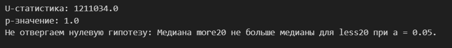
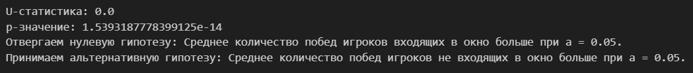
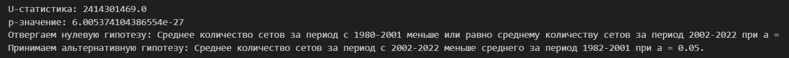
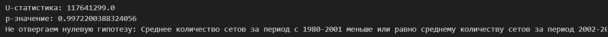
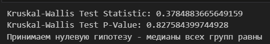
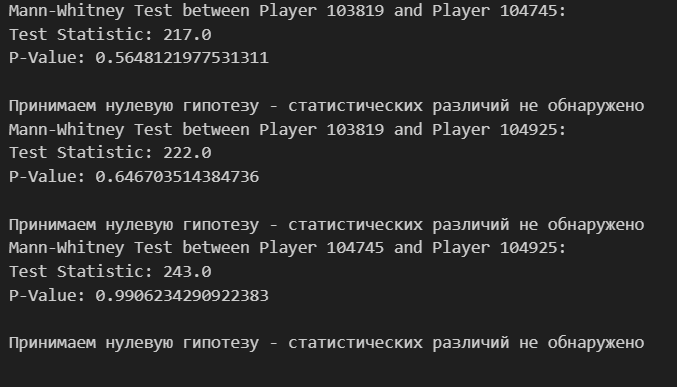

<h1 align="center">TENNIS GAME</h1>
<h2 align="center">Задание на анализ игр с 1968 по 2023 год.</h2>

## Оглавление

[1. Описание проекта](#1-описание-проекта)

[2. Описание датасета](#2-описание-датасета)

[3. Задачи](#3-задачи)

[4. Выводы](#выводы)

## 1. Описание проекта

Отработка навыков статистического анализа данных на Python на датасете теннисных игр

## 2. Описание датасета

Датасет собран из файлов данного репозитория - [tennis_atp/JeffSackmann](https://github.com/JeffSackmann/tennis_atp).

А именно - только данные из одиночного разряда (файлы в формате «atp_matches_YYYY.csv»)

Столбцами файла игрока являются `player_id`, `first_name`, `last_name`, `hand`, `birth_date`, `country_code`, `height` (cm).

Столбцами для файлов ранжирования являются `ranking_date`, `ranking`, `player_id`, `ranking_points` (где доступно).

## 3. Задачи

### Задание 1
Вы хотите узнать, как много значит ранг игрока в теннисе. Проверьте следующие утверждения:
    
    а) Если ранг игрока выше более, чем на 20 позиций, то в среднем он будет выигрывать с большей вероятностью. (Если хотите проверить статистически — формируйте выборку как отклонение от ожидаемого количества побед при случайном исходе);

    б) Если ранг игрока находится в окне +-5 позиций, то вероятность победы будет значительно отличаться от гипотезы из предыдущего случая. Для проверки статистической значимости выборку можно сделать как среднее по годам (например, с 1980 по 2022г.). Подумайте, как правильно сформировать репрезентативную выборку.

### Задание 2

Правда ли, что среднее количество сетов, которое необходимо любому игроку для победы в матче, сокращается со временем? Разбейте данные на две группы — с 1980 до 2001 гг. и 2002-2022 гг. Как изменилось среднее количество сетов, которое победитель затратил на игру? Является ли разница средних этих двух выборок статистически значимой? Выбор статистического теста обоснуйте.

### Задание 3

У вас появились сомнения — не является ли результат, который вы посчитали на предыдущем шаге, некорректным. Кажется, что на это мог повлиять формат самого матча — best of 3 или best of 5. Оставьте только матчи best of 5 (колонка best_of) и определите — является ли разница среднего количества сетов, которое сыграл победитель, значимой для выборок матчей по 1980 до 2001 гг. и 2002-2022 гг. Выбор статистического теста обоснуйте.

### Задание 4

Вы хотите изучить психологическую устойчивость профессиональных игроков в теннис. Одним из важных показателей такой устойчивости будет доля выигранных брейк-поинтов. Возьмите трех игроков (они необязательно должны играть в одно и то же время. Можете взять игроков, которые сильно отличаются по рангу, а можете взять примерно равных игроков), для каждого из них посчитайте долю выигранных брейк поинтов (колонки, заканчивающиеся на bpFaced и bpSaved) отдельно в победных и проигранных матчах за минимум 10 лет (можно больше, но годы должны идти подряд). Постройте box-plot’ы для этих статистик для каждого из игроков. Являются ли эти распределения по годам (по победным и по проигранным матчам) независимыми для каждого из игроков? Если сравнивать эту статистику между игроками — будет ли разница в средних для проигранных и выигранных матчей значимой попарно между всеми игроками? Выбор статистического теста обоснуйте.

### Задание 5

У вас есть гипотеза, что доля выигранных брейк-поинтов связана с вероятностью победить в игре. Соберите статистику, где для каждого матча будет собран его исход (победа/поражение) и доля выигранных брейк-поинтов (не забудьте, что в матче два игрока). Разделите долю выигранных брейкпоинтов на группы выше/ниже медианы и, используя информацию о исходе матча, проверьте зависимость между количеством выигранных брейкпоинтов и результатом матча. Насколько сильна эта зависимость? Выбор статистического теста обоснуйте.

## Выводы

### Выводы задания 1_а

1)

В первой выборке (ранг выше более чем на 20 позиций) среднее отклонение значительно выше, чем во второй выборке, a значит это  подтверждает гипотезу о большей вероятности выигрыша у игроков с более высоким рангом.

2) Выборки не подчиняется нормальному закону распределения.

3) При проведении статистического теста получены следующие результаты: 

### Выводы задания 1_б

1) Одна из выборок имеет нормальное распределение, а вторая - нет.  Поэтому для проведения статистического теста будет использоваться непараметрический тест Манна-Уитни

2) Вероятность победы игроков входящих в окно $\pm$ 5 позиций не отличается от вероятности прошлых игроков

### Задание 2

1) Выборки не подчиняются нормальному закону распределения

2) Утверждение, что среднее количество для любого игрока уменьшается со временем - верно

### Задание 3

1) Выборки не подчиняются нормальному закону распределения

2) Утверждение, что среднее количество для любого игрока уменьшается со временем - не верно.

### Задание 4

1)  

2) 

3) Исходя из результатов обоих тестов, мы можем сделать вывод, что данные не показывают статистически значимых различий в количестве побед и поражений между рассматриваемыми игроками.

## Задание 5

p-значение равно 0.5, это означает, что при уровне значимости 0.05 (или 5%), у нас нет статистически значимых доказательств для отвержения нулевой гипотезы о том, что медианы двух связанных выборок равны.

Таким образом, на основании этого результата, можно сделать вывод, что нет статистически значимой разницы между значениями "less median" и "more median" в датасете count_of_games.